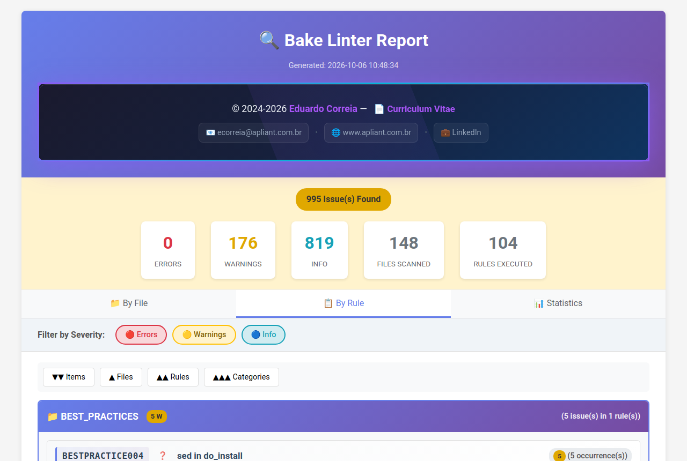
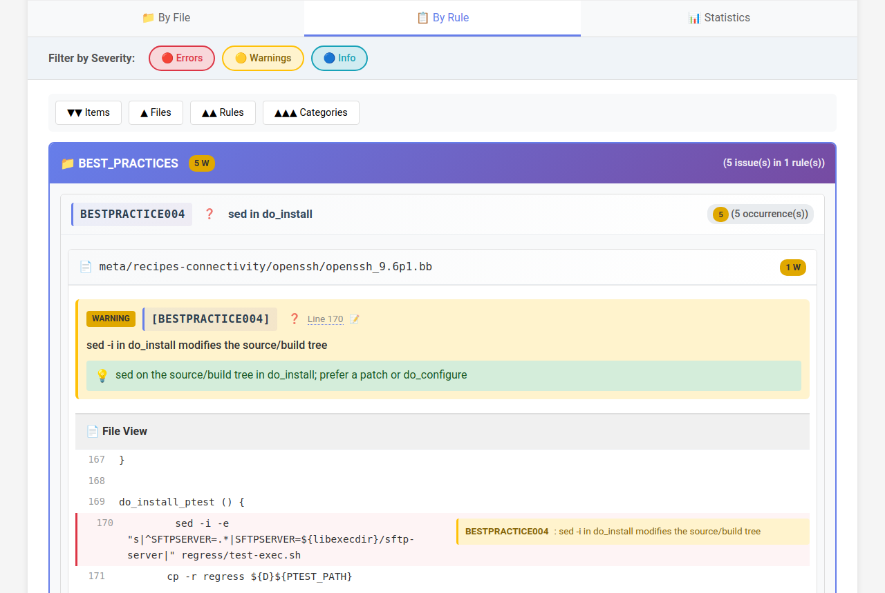
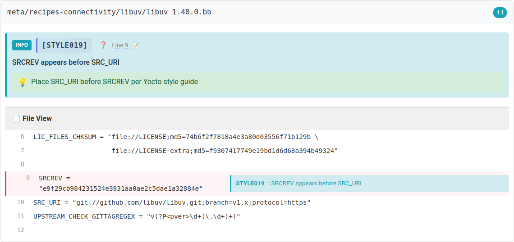
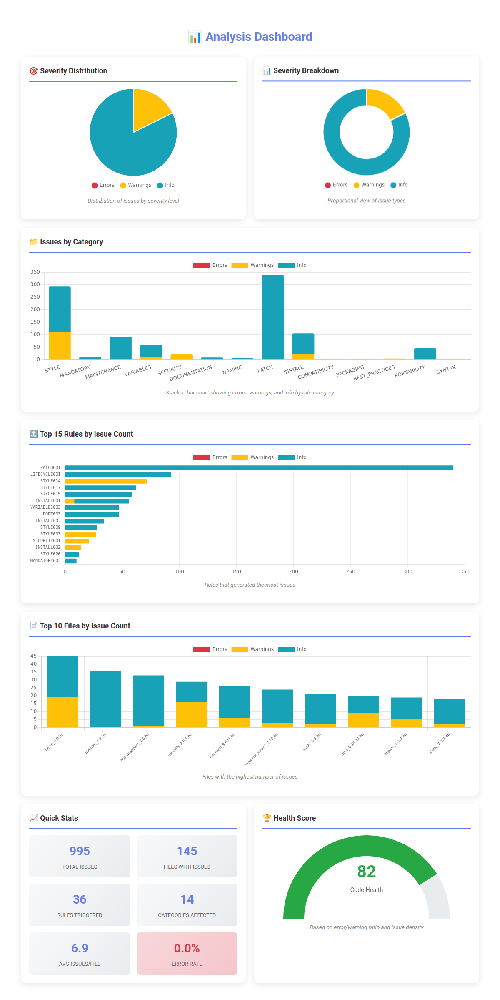
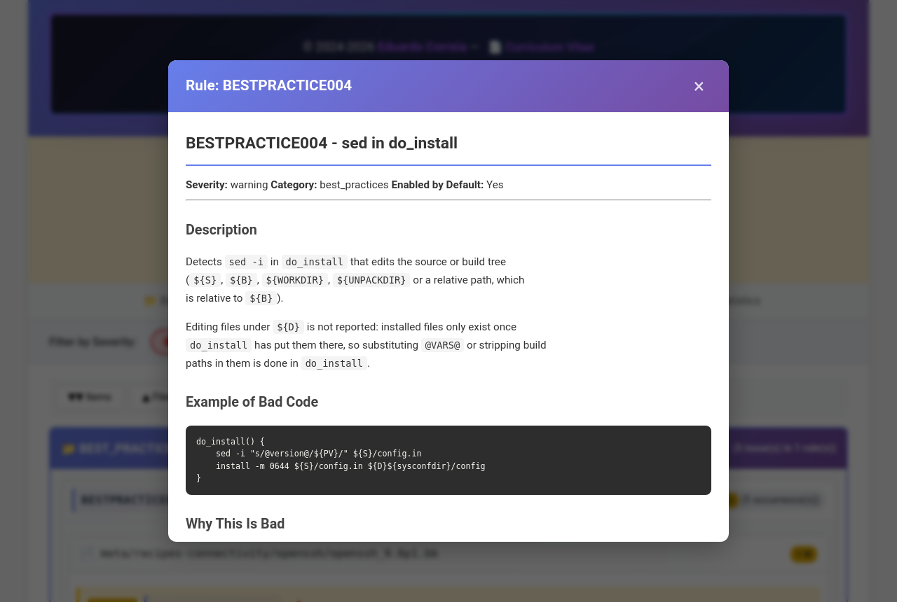

# Bake Linter

[](COPYING.LESSER)

Static analysis for BitBake recipes.

Copyright (c) 2024-2026 Eduardo Correia <ecorreia@apliant.com.br>

bake_linter checks `.bb`, `.bbappend` and `.inc` files of Yocto Project and
OpenEmbedded layers for mistakes BitBake will not catch, or will only catch
late in a build: missing licence information, plaintext downloads, files
installed but never packaged, dependencies on packages that do not exist,
old override syntax, and many style issues. It also runs
[oelint-adv](https://github.com/priv-kweihmann/oelint-adv) for you, so one
command gives both tools' findings.

- [Features](#features)
- [The HTML report](#the-html-report)
- [Installation](#installation)
- [Usage](#usage)
- [Exit codes](#exit-codes)
- [Configuration](#configuration)
- [Inline suppression](#inline-suppression)
- [Rules](#rules)
- [Output formats](#output-formats)
- [Pre-commit hook](#pre-commit-hook)
- [CI integration](#ci-integration)
- [oelint-adv](#oelint-adv)
- [Documentation site](#documentation-site)
- [Contributing](#contributing)
- [License](#license)

## Features

- **110 rules** in families such as license, security, supply chain,
  packaging, install, systemd, syntax, style and bbappend, each with a
  documentation page. See [docs/rules/](docs/rules/README.md).
- **Reads recipes the way BitBake does**, beyond single lines: continuation
  lines, function bodies, inherited classes, `require`/`include` within the
  layer, and `${PN}`. A rule that cannot know the answer (for example because
  an included file is in another layer) stays silent instead of guessing.
- **Inline suppression** with `# nolint: RULE_ID`.
- **Output** as coloured text, compact one-line findings, JSON, JSON Lines or
  a self-contained HTML report; several at once.
- **CI-friendly**: no-colour mode and exit codes that separate warnings,
  errors and tool failures.
- **Configuration** in one YAML or JSON file, with command-line overrides.
- **oelint-adv** runs as a second pass when it is installed.
- **A pre-commit hook** that lints only the staged recipes.

## The HTML report

`bake-linter --output html,report.html <layers>` writes a self-contained
report. These screenshots are from a run over three directories of
poky: `meta/recipes-extended`, `meta/recipes-connectivity` and
`meta-skeleton`.

The summary, with the counts by severity, the views and the severity
filters:



Findings grouped by rule family and rule, each with its hint and the
recipe lines around it:



The same findings for one recipe:



The statistics view: severities, categories, the rules and files with the
most findings, and an overall score:



Every rule ID opens the rule's documentation, with an example and the fix:



## Installation

bake_linter needs Python 3.9 or newer. oelint-adv, which is optional, needs
Python 3.10 or newer.

```bash
git clone --recurse-submodules https://github.com/99ecarvalho/bake_linter.git
cd bake_linter

python3 -m venv .venv
source .venv/bin/activate

pip install -e .                     # bake_linter
pip install -e ./vendor/oelint-adv   # optional: oelint-adv
```

Or install the `bake-linter` command for your user with
[pipx](https://pipx.pypa.io/), oelint-adv included:

```bash
./install.sh
```

The script installs pipx if it is missing (on Debian and Ubuntu it runs
`sudo apt-get install pipx`, so it may ask for your password), initialises
the submodule, and installs both packages in editable mode, so a `git pull`
updates the command.

Check the installation:

```bash
bake-linter --version
```

## Usage

```bash
# Lint a layer, a directory or single files
bake-linter meta-mylayer/
bake-linter recipes-core/foo/foo_1.0.bb

# Only some rules, or without some
bake-linter --enable LICENSE001,MANDATORY001 meta-mylayer/
bake-linter --disable-group style meta-mylayer/

# Skip paths (repeatable)
bake-linter --exclude 'build/*' --exclude '*.bak' .

# Write reports; --output can be repeated
bake-linter --output html,report.html --output json,report.json meta-mylayer/

# One line per finding, for editors and grep
bake-linter --format compact meta-mylayer/

# CI: no colours, and fail on warnings too
bake-linter --ci --warnings-as-errors meta-mylayer/

# What is there and what is in effect
bake-linter --list-rules
bake-linter --list-groups
bake-linter --show-config
```

`--quiet` hides the findings on standard output but still writes report
files and summaries. `--verbose` adds the matching code to each finding.
`--debug` (or `BAKE_LINTER_DEBUG=1`) prints how oelint-adv is found and run.
Run `bake-linter --help` for every option.

## Exit codes

| Code | Meaning |
| --- | --- |
| 0 | No findings, or only info |
| 1 | Warnings, no errors |
| 2 | Errors |
| 3 | Configuration or runtime error, including an oelint-adv run that failed |

With `--warnings-as-errors`, warnings give exit code 2. The exit code is based
on bake_linter's own findings; oelint-adv findings are reported but do not
change it.

## Configuration

bake_linter reads the first of these files that exists in the current
directory: `.bake-linter.yaml`, `.bake-linter.yml`, `.bake-linter.json`,
`bake-linter.yaml`, `bake-linter.yml`, `bake-linter.json`. If none does, it
falls back to [config/.bake-linter.yaml](config/.bake-linter.yaml) in the
bake_linter checkout, which lists every rule and is a good starting point to
copy. `--config FILE` picks a file explicitly. The file in use is printed at
startup.

```yaml
rules:
  LICENSE001:
    enabled: true
    severity: error        # error, warning or info
  STYLE001:
    enabled: false
  STYLE002:
    options:
      max_length: 100

# Instead of listing rules one by one
disable_groups:
  - formatting

settings:
  skip_autogenerated: true   # skip files marked as generated
  max_line_length: 120       # STYLE002 limit, unless the rule sets max_length
  color: true
  # Release your layers build for. bake_linter grades release-specific
  # findings by it (e.g. S = "${WORKDIR}", fatal from styhead on), and passes
  # it to oelint-adv's --release.
  oelint_release: scarthgap
  # Machines your BSP defines, so oelint-adv accepts overrides on them
  oelint_extra_machines:
    - my-board

exclude:
  - "build/*"
  - "tmp/*"
```

Command-line options override the file, and the file overrides the built-in
defaults. `enable` and `disable` lists of rule IDs, and `enable_groups`, are
accepted too.

## Inline suppression

```bitbake
# The next line that is not a comment is not checked for LICENSE001
# nolint: LICENSE001
SUMMARY = "Meta package"

# Several rules
# nolint: LICENSE001, MANDATORY001
RDEPENDS:${PN} = "pkg-a pkg-b"

# Only this line
SRC_URI = "http://example.com/foo.tar.gz"  # nolint: SECURITY001

# Every rule (use sparingly)
# nolint: *
LEGACY = "1"
```

- A comment on its own line applies to the next line that is not a comment,
  so several suppressions can be stacked above one line.
- A comment at the end of a line applies to that line only.
- Some findings concern the file as a whole and have no line, for example a
  missing `LICENSE`. A comment on its own line naming the rule, anywhere in
  the file, suppresses those.
- `nolint` and rule IDs are case-insensitive.

Say why next to the suppression, and prefer fixing the recipe. See
[docs/INLINE_SUPPRESSION.md](docs/INLINE_SUPPRESSION.md) for more.

## Rules

Each rule has an ID made of its family and a number, a severity, and a page
under [docs/rules/](docs/rules/) with an example, the reason and the fix.
The [rule index](docs/rules/README.md) lists all of them with their
severity and default state.

| Family | What it checks |
| --- | --- |
| LICENSE, MANDATORY, DOC, METADATA | Licence information and the metadata every recipe should carry |
| SECURITY | Plaintext downloads, world-writable and setuid installs, credentials, build paths leaking into packages |
| SUPPLY, REPRO, URI, SRCREV | Source pinning, unreliable hosting, git URIs and revisions |
| PKG, DEPENDENCY, DEPENDS | Packaging: FILES coverage, packages that do not exist, dependency types |
| INSTALL, PORT, SYSTEMD | do_install hygiene, hardcoded host paths, systemd integration |
| SYNTAX, DEPRECATED | Override syntax, quoting, removed functions and variables |
| STYLE, NAMING, VARIABLES | Formatting, ordering and naming, from the OpenEmbedded style guide |
| BBAPPEND, LAYER, COMPAT, LIFECYCLE, PATCH, TASK, FUNCTION, PYTHON, BESTPRACTICE | Layer- and task-level checks |

Severities: **error** means the recipe is wrong or BitBake's QA will reject
it; **warning** means it probably does something unintended or unsafe;
**info** is a style or maintenance suggestion.

## Output formats

| Format | Use |
| --- | --- |
| `text` | Default. Coloured, grouped by file. |
| `compact` | `file:line: severity: [RULE] message`, one per line. |
| `json` | One document with a summary and all findings, plus oelint-adv's. |
| `jsonl` | One JSON object per finding, for streaming and log tools. |
| `html` | A self-contained report with filters, statistics and rule help. |

`--format` sets what is printed; `--output FORMAT,FILE` writes a file and
can be repeated. With an HTML report and oelint-adv installed, oelint-adv's
findings are also written to a second file next to it, `<name>_oelintadv.html`.

## Pre-commit hook

From inside the repository whose recipes you want checked:

```bash
/path/to/bake_linter/hooks/install-hooks.sh
```

This links [hooks/pre-commit](hooks/pre-commit) into that repository. On
each commit it lints the staged versions of the staged `.bb`, `.bbappend`
and `.inc` files. Warnings let the commit through; errors, and a linter that
fails to run, block it. `git commit --no-verify` skips it.

## CI integration

```yaml
# GitHub Actions
- name: Lint recipes
  run: |
    pip install git+https://github.com/99ecarvalho/bake_linter.git
    bake-linter --ci --output json,bake-linter.json meta-mylayer/
```

```yaml
# GitLab CI
lint:
  script:
    - pip install git+https://github.com/99ecarvalho/bake_linter.git
    - bake-linter --ci --output html,bake-linter.html meta-mylayer/
  artifacts:
    when: always
    paths:
      - bake-linter.html
```

Installing from Git this way does not include oelint-adv; add
`pip install oelint-adv` if you want it in CI too. Use
`--warnings-as-errors` to fail the job on warnings.

## oelint-adv

When oelint-adv and its dependencies can be imported, bake-linter runs it
after its own rules and reports its findings separately. If it cannot be
found, bake-linter says so and carries on; if it is found but fails, the run
exits with code 3. [COMPARE.md](COMPARE.md) explains how the two tools differ
and how to use them together.

## Documentation site

The rule pages and guides under [docs/](docs/) can be built into a static
site with MkDocs, in Docker:

```bash
cd docs
./build-docs.sh build   # HTML in _site/
./build-docs.sh serve   # preview on http://localhost:8001
```

## Contributing

Bug reports, false positives with a minimal recipe that shows them, and pull
requests are welcome. [CONTRIBUTING.md](CONTRIBUTING.md) explains how the
code is organised, how to write a rule and its tests, and the conventions
for commits.

```bash
pip install -e ".[dev]"
pytest
```

## License

bake_linter is free software: you can redistribute it and/or modify it under
the terms of the **GNU Lesser General Public License, version 3 or (at your
option) any later version**. The license text is in
[COPYING.LESSER](COPYING.LESSER); it supplements the GNU General Public
License v3, included as [COPYING](COPYING).

This program is distributed in the hope that it will be useful, but WITHOUT
ANY WARRANTY; without even the implied warranty of MERCHANTABILITY or FITNESS
FOR A PARTICULAR PURPOSE. See the licenses for details.

Reports generated by bake_linter are yours; the license covers the software,
not its output.

The vendored [oelint-adv](https://github.com/priv-kweihmann/oelint-adv)
submodule under `vendor/` is a separate project under its own license
(BSD-2-Clause, see `vendor/oelint-adv/LICENSE`).
